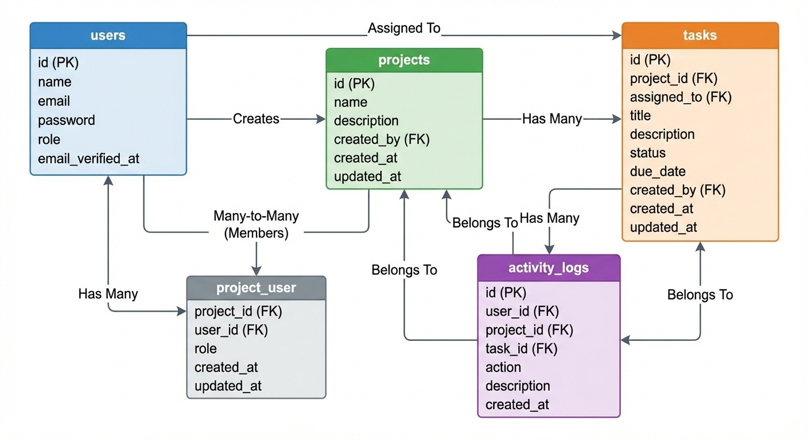
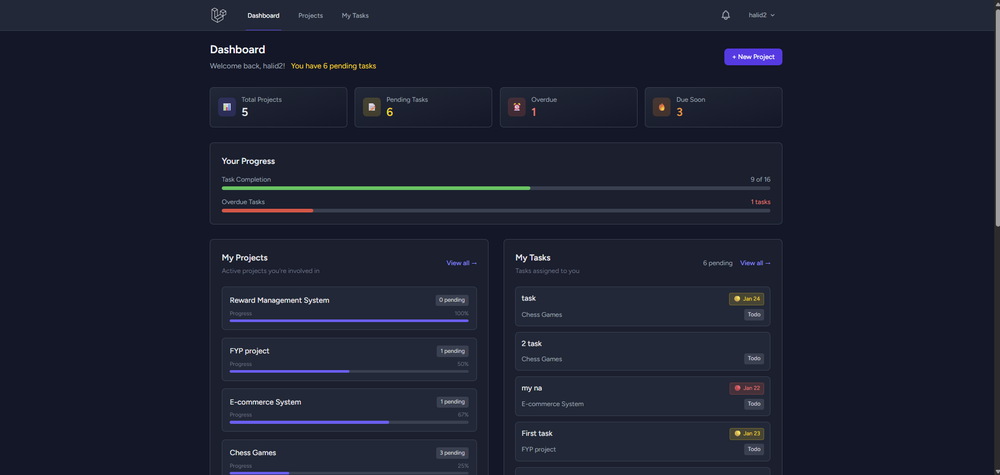
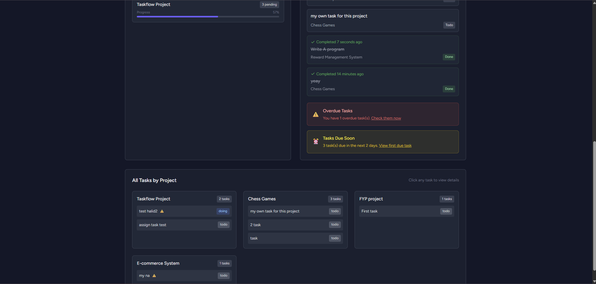
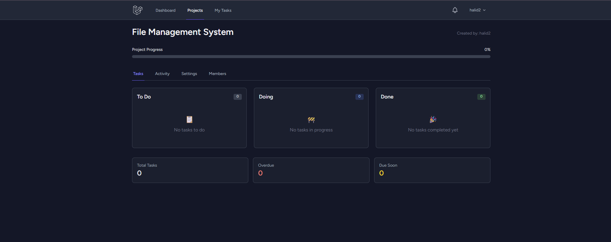
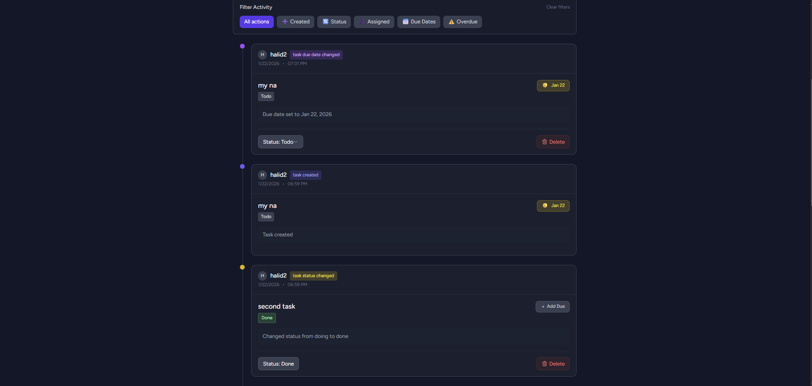
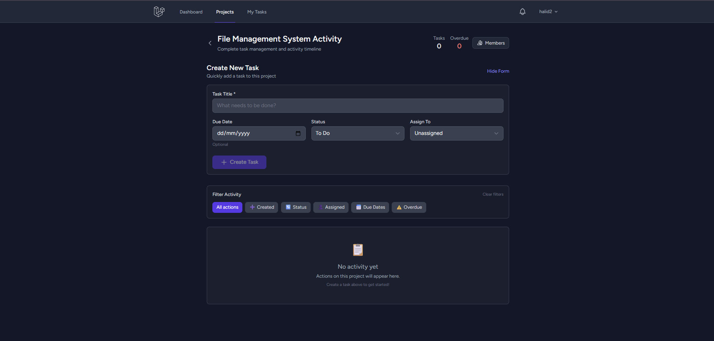

# TaskFlow 🚀

**TaskFlow** is a professional project and task management system built with **Laravel 12**, **Blade**, and **Alpine.js**. It supports **role-based access**, **task workflows**, and **activity tracking**, making it a mini-Jira/Trello style app.  

This project demonstrates real-world full-stack development, backend-enforced business logic, and SPA-like frontend interactivity.

---

## ✨ Features

- **Authentication & Roles:** Admin, Manager, User; secure role-based access via Laravel Policies  
- **Project Management:** CRUD projects, ownership & member roles, secure visibility rules  
- **Task Management:** Tasks belong to projects, assignable to members, status workflow (`todo → doing → done`), due dates  
- **Activity Logging:** Centralized logging for all actions, paginated feed with human-readable timestamps  
- **Notifications:** Database notifications for task assignments 
- **Frontend UX:** Reactive activity feed, inline editing, loading states, color-coded action badges, permission-aware UI  

---
<div align="center">
## 🛠 Tech Stack

| Layer          | Technology |
|----------------|------------|
| Backend        | Laravel 12, PHP 8.2 |
| Frontend       | Blade, Alpine.js |
| Auth           | Laravel Breeze |
| Database       | MySQL |
| Version Control| Git & GitHub |
| Build Tool     | Vite, Node.js |
</div>

---

## 🗄️ Database Schema

<div align="center">
  
  <p><em>Database relationships and table structure</em></p>
</div>

### **Core Tables:**

```sql
users:
  id (PK), name, email, email_verified_at, password, role, remember_token

projects:
  id (PK), name, description, created_by (FK → users.id)

tasks:
  id (PK), project_id (FK → projects.id), title, status, 
  assigned_to (FK → users.id), due_date, created_by (FK → users.id)

activity_logs:
  id (PK), user_id (FK → users.id), project_id (FK → projects.id),
  task_id (FK → tasks.id), action, description, meta (JSON)

project_user (pivot):
  project_id (FK → projects.id), user_id (FK → users.id), 
  role, created_at, updated_at

```
### **Project Pictures:**

<div align="center">
  
  <p><em>Dashboard Page</em></p>
</div>

<div align="center">
  
  <p><em>Cont. Dashboard Page</em></p>
</div>

<div align="center">
  
  <p><em>Project Page</em></p>
</div>

<div align="center">
  
  <p><em>Activity Time Line Page</em></p>
</div>

<div align="center">
  
  <p><em>Cont. Activity Time Line Page</em></p>
</div>

<div align="center">
  
  <p><em>Tasks Page</em></p>
</div>
